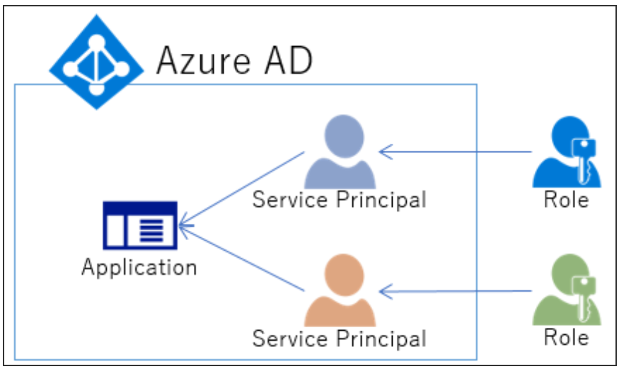

[](https://dev.azure.com/koheisaito/pipelines-java/_build/latest?definitionId=4&branchName=master)

# Azure DevOps Tutorial

## サービスプリンシパルとは
 - 一言でいうと、別名実行アカウントのこと。（[参考](https://blog.nextscape.net/archives/Date/2016/07/azure-ad-serviceprincipal)）
 
 - アプリケーションを実行するためのアカウントがサービスプリンシパル。
 - 各サービスプリンシパルに対して、「読み取り専用」「仮想マシン起動・停止のみ」といったロールを割り当てるイメージ。
 - アプリケーション：サービスプリンシパル = 1：多
   - つまり、割り当てたいロールごとにサービスプリンシパルを作成可能。 
 - Azure Subscription 内部のリソースにアクセスする際に必要となる。

## Fork the following repository to your GitHub account
https://github.com/MicrosoftDocs/pipelines-java

## Create a new Java pipeline
1. Azure DevOps 組織にサインインし、プロジェクトに移動する。
2. プロジェクト内で、「パイプライン」ページに移動する。
3. ソースコードの場所として、GitHub を選択する。
4. サインイン画面に遷移するので、認証情報を入力する。
5. リポジトリの一覧が表示されたら、対象となるアプリケーションのリポジトリを選択する。
6. Azure Pipeline によってリポジトリが分析される。上記のサンプルリポジトリは、Maven パイプラインテンプレートが推奨される。<br>
   [Save and run]を選択し、適宜 Commit message を入力する。[Commit directly to the master branch]を選択し、[Save and run]を選択する。<br>
   パイプラインは、プロジェクトのルートに作成される `azure-pipelines.yml` にて定義する。
   Job Status は、GUI にて確認可能。
   

## Add a status badge to the repository
1. Azure Pipelines で、[Pipeline]ページにアクセスし、パイプラインの一覧を表示する。前のセクションで作成したパイプラインを選択する。
2. パイプラインのコンテキストメニューで、[Status badge]を選択する。
3. サンプルマークダウンが表示されるので、コピーする。

## Usage of multiple values (Versions, OS, ...)
`strategy` と `matrix` を活用して、複数の値を yml ファイルに指定することが可能。<br>
これにより、複数の OS や複数の Version の言語などを使用してビルドすることが可能。<br>
<br>
例）複数のプラットフォームにまたがってビルドする。

```
strategy:
  matrix:
    linux:
      imageName: "ubuntu-16.04"
    mac:
      imageName: "macos-10.14"
    windows:
      imageName: "vs2017-win2016"
  maxParallel: 3

pool:
  vmImage: $(imageName)
```

各エージェントは、一度に1つのジョブしか実行できない。複数のジョブを並列実行するためには、複数のエージェントを構成する必要がある。

## Use service principal to deploy the application
セキュリティ上の理由から、自動化ツールにはユーザ ID でのログインを許可するのではなく、常にサービスプリンシパルを使用することを推奨する。（[参考](https://docs.microsoft.com/ja-jp/azure/active-directory/develop/howto-create-service-principal-portal)）

Azure portal からサービスプリンシパルを直接作成することはできない。 Azure portal 経由でアプリケーションを登録するときに、アプリケーションオブジェクトとサービスプリンシパルは、自動的にホームディレクトリまたはテナントに作成される。（[参考](https://docs.microsoft.com/ja-jp/azure/active-directory/develop/app-objects-and-service-principals)）

### Check Azure AD permissions
自分のロールを確認する。[User]ロールを持っている場合は、管理者以外のユーザがアプリケーションを登録できることを確認する必要がある。


[アプリの登録]設定を確認する。<br>
[はい]に設定されている場合は、Azure AD テナント内のすべてのユーザがアプリを登録可能。<br>
[いいえ]に設定されている場合は、管理者ロールを持つユーザのみが、アプリケーションを登録可能。<br>
もし[いいえ]に設定されているユーザがアプリケーションを登録したい場合は、管理者に権限を与えてもらう必要がある。

### Check Azure Subscription permissions
Azure Subscription で AD アプリにロールを割り当てるには、アカウントが `Microsoft.Authorization/*/Write` アクセス権を持っている必要がある。<br>
アカウントに `共同作成者` ロールが割り当てられている場合は、適切なアクセス許可がない。この場合、サービスプリンシパルにロールを割り当てようとすると、エラーが発生する。


## Register an application with Azure AD and Create a service principal
[Azure Active Directory] > [アプリの登録] > [新規登録] の順に遷移。


これで、Azure AD アプリケーションとサービスプリンシパルの作成が完了した。

## Assign a role to the application
サブスクリプション内のリソースにアクセスするには、アプリケーションにロールを割り当てる必要がある。
割り当てるロールは[こちら](https://docs.microsoft.com/ja-jp/azure/role-based-access-control/built-in-roles)に記載の通り。<br>

[サブスクリプション] > [アクセス制御（IAM）] > [ロールの割り当ての追加] を選択し、アプリケーションに割り当てるロールを選択する。<br>
例えば、アプリケーションがインスタンスの<b>再起動</b>・<b>開始</b>・<b>停止</b>の実行を許可するには、[Contributer （共同作成者）]ロールを選択する。<br>
※デフォルトでは、Azure AD アプリケーションは、使用可能なオプションに表示されない。そのため、名前を検索して選択する必要がある。


## Get tenant and app ID values for signing in
プログラムからサインインする際は、テナントID、アプリケーションIDを渡す必要がある。<br>
証明書、または認証キーも必要となる。

テナントID、アプリケーションIDは下記のように取得可能。<br>
[Azure AD] > [アプリの登録] > アプリケーションを選択し、Portal に表示される値をアプリケーションコード内に保存する。


## Authentication : 2 options
サービスプリンシパルで使用可能な2つの認証方式。
1. 証明書のアップロード
既存の証明書がある場合は、使用可能。テスト目的でのみ、自己署名証明書を作成可能。<br>
自己署名証明書の作成方法は下記の通り。

```
$cert=New-SelfSignedCertificate -Subject "CN=DaemonConsoleCert" -CertStoreLocation "Cert:\CurrentUser\My"  -KeyExportPolicy Exportable -KeySpec Signature
```

2. 新規にアプリケーションシークレットを作成
Azure portal からシークレットを作成可能。<br>
[Azure Active Directory] > [アプリの登録] > [証明書とシークレット] > [クライアントシークレット] > 説明と期間を入力。


<b>※値は一度しか表示されないので、忘れずにメモを取ること。</b>

## サービスプリンシパルでログイン

Azure にログインし、サービスプリンシパルを作成。

1. Azure CLI

```powershell
> az login
> az ad sp create-for-rbac -n "foo-bar-app" --role contributor
{
  "appId": "*********************",
  "displayName": "foo-bar-app",
  "name": "http://foo-bar-app",
  "password": "**********************************",
  "tenant": "******-******-****-*******-***************"
}
```
<b>※値は一度しか出力されないので、忘れずにメモを取ること。</b>
（参考：[Azure CLI - az ad sp](https://docs.microsoft.com/ja-jp/cli/azure/ad/sp?view=azure-cli-latest)）


```powershell
> az login --service-principal -u "your-application-id" --password "your-password" --tenant "your-tenant-id"
```

2. Python

```python
from azure.common.credentials import ServicePrincipalCredentials
 
TENANT-ID = 'your-tenant-id'
CLIENT = 'your-application-id'
KEY = 'your-password'
 
credentials = ServicePrincipalCredentials (
    client-id = CLIENT,
    secret = KEY,
    tenant = TENANT-ID
  )
```
（参考：[credentials Module](https://docs.microsoft.com/en-us/python/api/azure-common/azure.common.credentials?view=azure-python)）

## Azure DevOps の認証にサービスプリンシパルを加える。

[Project Settings] > [Service connections] > [New service connection] > [Azure Resource Manager] を選択し、サービスプリンシパルに関する情報を入力。


